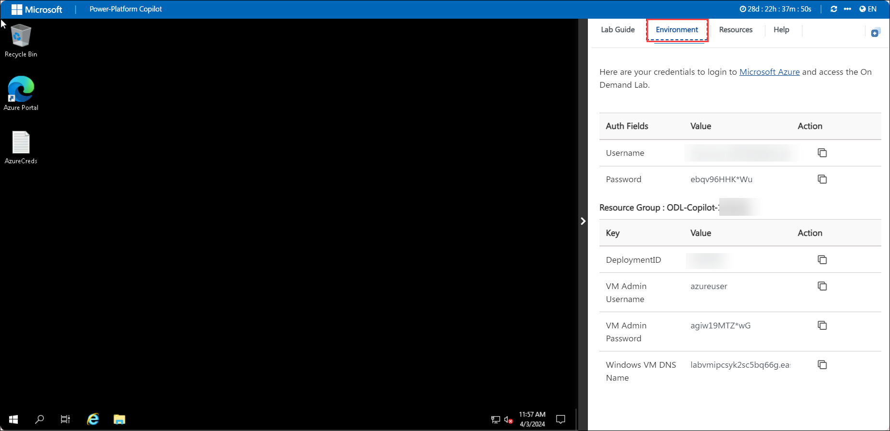
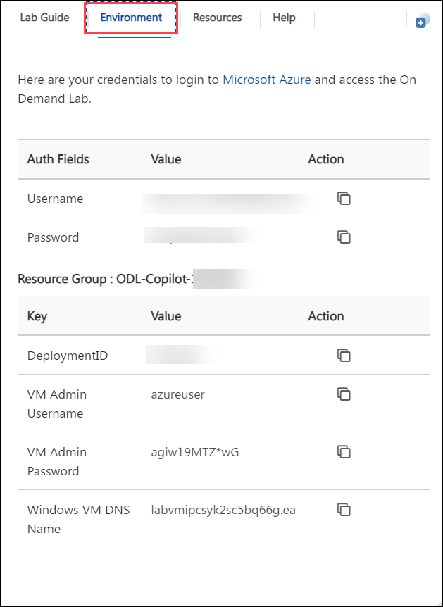
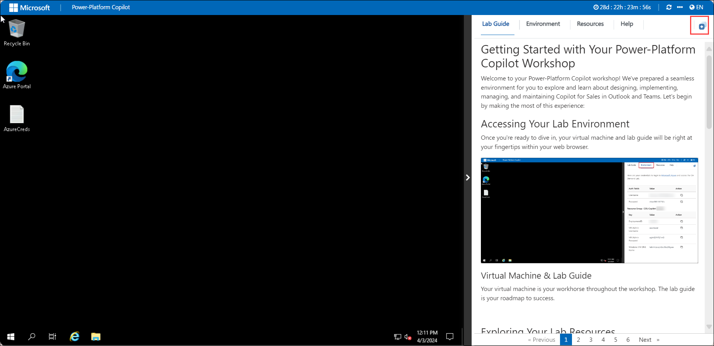

# Power Platform Copilot

### Overall Estimated Duration: 8 Hours

## Overview

This lab offers hands-on experience with Power Platform Copilot, Microsoft's AI-powered assistant designed to enhance app development, automation, and data analysis within the Power Platform ecosystem. Participants will explore how Copilot streamlines workflows in Power Apps, Power Automate, and Power Virtual Agents, using natural language prompts to build solutions faster.

## Objective

By the end of this lab, you will :

- **Power Apps Copilot**: Generate and refine apps with AI-assisted design.
- **Power Automate Copilot**: Create and optimize automated workflows using AI suggestions.
- **Power Virtual Agents Copilot**: Develop intelligent chatbots with minimal coding.

## Pre-requisites

### Prerequisites for the Power Platform Copilot Lab:   

1. **Microsoft Power Platform Access** – An active **Microsoft Power Apps** and **Power Automate** environment.  

2. **Basic Understanding of Power Platform** – Familiarity with **Power Apps, Power Automate, and Power Virtual Agents** is recommended but not mandatory.  

3. **Microsoft Account** – A work or school account with appropriate permissions to access Power Platform features. 

4. **Basic AI Knowledge** (Optional) – An understanding of AI-assisted tools and their applications can be beneficial.  

## Getting Started with Your Lab Environment
 
Welcome to your Power Platform - App in a Day! We've prepared a seamless environment for you to explore and learn about these services. Let's begin by making the most of this experience.
 
## Accessing Your Lab Environment
 
Once you're ready to dive in, your virtual machine and lab guide will be right at your fingertips within your web browser.

    

### Virtual Machine & Lab Guide
 
 Your virtual machine is your main tool throughout the workshop. The lab guide is your roadmap to success.
 
## Exploring Your Lab Resources
 
To get a better understanding of your lab resources and credentials, navigate to the **Environment** tab.
 
   
 
## Utilizing the Split Window Feature
 
For convenience, you can open the lab guide in a separate window by clicking on the **Split Window** button in the top right corner.
 
    
 
## Managing Your Virtual Machine
 
Feel free to **start, stop, or restart (2)** your virtual machine as needed from the **Resources (1)** tab. Your experience is in your hands!

    

## Steps to Proceed with MFA Setup if "Ask Later" Option is Not Visible

1. At the **"More information required"** prompt, select **Next**.

1. On the **"Keep your account secure"** page, select **Next** twice.

1. **Note:** If you don’t have the Microsoft Authenticator app installed on your mobile device:

   - Open **Google Play Store** (Android) or **App Store** (iOS).
   - Search for **Microsoft Authenticator** and tap **Install**.
   - Open the **Microsoft Authenticator** app, select **Add account**, then choose **Work or school account**.

1. A **QR code** will be displayed on your computer screen.

1. In the Authenticator app, select **Scan a QR code** and scan the code displayed on your screen.

1. After scanning, click **Next** to proceed.

1. On your phone, enter the number shown on your computer screen in the Authenticator app and select **Next**.
       
1. If prompted to stay signed in, you can click "No."
 
1. If a **Welcome to Microsoft Azure** pop-up window appears, simply click "Maybe Later" to skip the tour.

## Support Contact

1. The CloudLabs support team is available 24/7, 365 days a year, via email and live chat to ensure seamless assistance at any time. We offer dedicated support channels tailored specifically for both learners and instructors, ensuring that all your needs are promptly and efficiently addressed.

   Learner Support Contacts:

   - Email Support: cloudlabs-support@spektrasystems.com
   - Live Chat Support: https://cloudlabs.ai/labs-support

1. Now, click on Next from the lower right corner to move on to the next page.
   
## Happy Learning!!