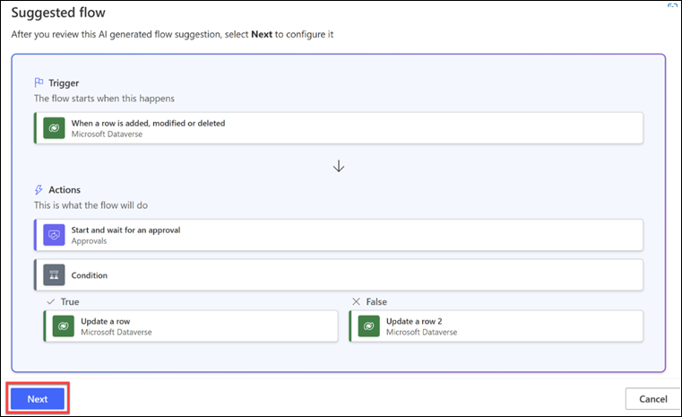
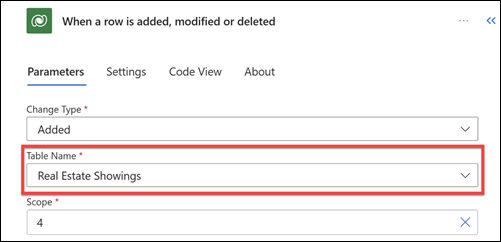
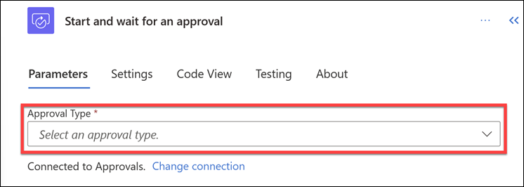
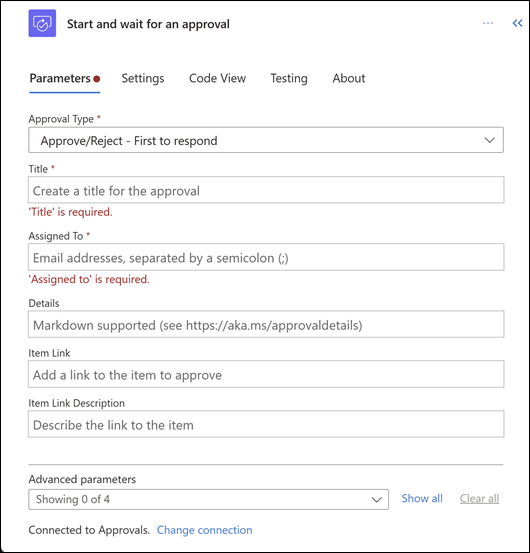
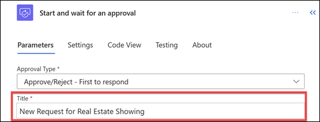
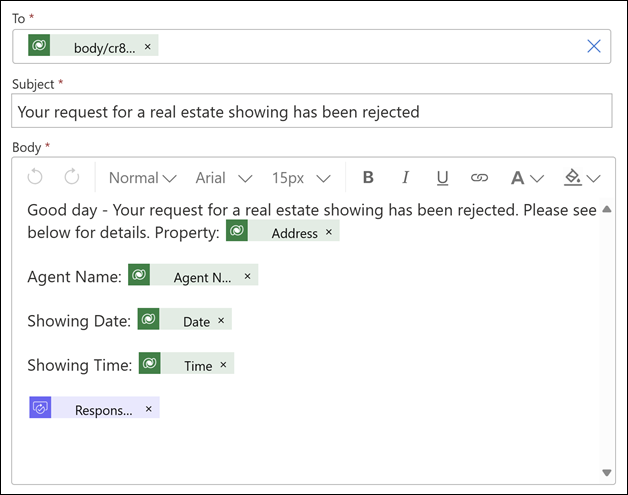
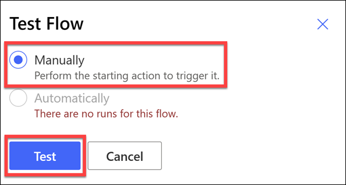
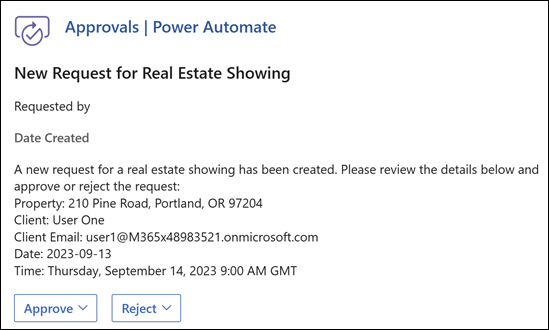
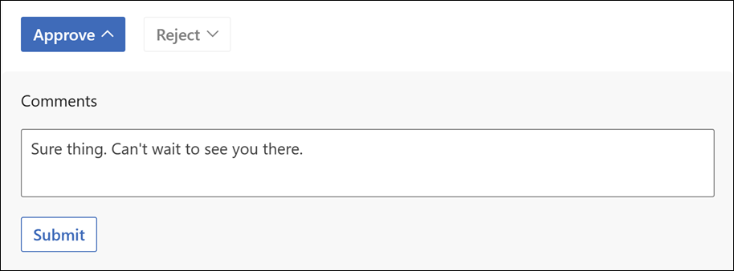
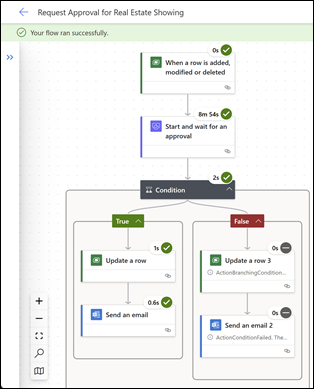

# Lab-02: Create an approval flow with Copilot in Power Automate.

## Lab Scenario

In this exercise, you will create an approval flow using Power Automate. Your objective is to automate a process where a request is submitted and requires approval before proceeding. Start by accessing Power Automate and selecting the option to create a new flow. Use the built-in templates or create a flow from scratch, setting up triggers and actions to handle the approval process. Configure the flow to send approval requests to designated users, capture their responses, and perform actions based on their decisions. This exercise will demonstrate how to automate and streamline approval workflows efficiently.

## Lab objectives

In this lab, you will complete the following tasks:

- Task 1 : Create an approval flow.
- Task 2 : Update the flow ,send an email and Run the App.
  
## Task – 01: Create an approval flow.

In this task, you'll create an approval flow using Power Automate to automate the process of submitting requests for approval. You'll configure the flow to handle approval requests, capture responses, and execute actions based on those responses.

1. Sign in to https://make.powerautomate.com.

2. In the center of the Home page within Power Automate enter the following prompt: ` Request approval when a dataverse record with a approvals and condition below approvals true or false `, Select the **Submit** button .

   

4. From the prompt, Copilot provides the outline for a suggested flow that you can review. To accept the flow, select **Next**
   
5. Review the connected apps and services. If a connection hasn't been made, edit or fix it and then select **Create flow**.The Edit with Copilot designer opens with your flow along with a Copilot chat window on the right.
  
6. Set up some parameters by selecting the **When a row is added,** modified or deleted trigger.A panel on the left side of the screen shows the trigger details, including an empty Table Name parameter that's required.

   

7. From the Table Name dropdown menu, search for and select **Real Estate Showings**.

   

8. Select the **Start and wait for an approval action**. Notice that the Approval Type parameter is missing.

   

9. From the **Approval Type dropdown** menu, select **Approve/Reject - First to respond**.After you select the Approval Type, more parameters are now available.

   

10. In the Copilot chat window, enter the following prompt:  Add "**New Request for Real Estate Showing**" as the Title parameter for the **Start and wait for an approval action** ,It takes a few seconds for Copilot to process the prompt. When processing is complete, the Title parameter is populated with the prompt text.

    

11. For the Assigned To parameter, enter the **email address** **<inject key="AzureAdUserEmail"></inject>** that you're using for this lab. This email address is the one that receives the approval request.

12. For the Details parameter, enter the following text:`A new request for a real estate showing has been created. Please review the details below and approve or reject the request:
    ```
    - Property:
    - Client:
    - Client Email:
    - Date:
    - Time:

    ```
      

14. Place your curser next to Property: in the Details parameter and then select the lightning icon to open the Dynamic content pane.

    

15. In the Dynamic content pane, select See More to expand the list of available dynamic content.

    

16. Scroll down until you find the Address field and then select it.

    

17. The  **Client Address** dynamic content field is now added to the Details parameter.

    

18. Complete the same steps for the **Client Address,Client Full Name, Client Email , Date, and Time fields**, When you're done with the rest of the fields, the values should resemble the following image.

    

19. With the Details parameter completed, you can collapse the **Start and wait for an approval action** by selecting the double arrow icon.

    

20. Select the **Condition action**.

21. Select the Choose a value box and then select **Outcome from the Dynamic content** pane.

    

22. Select is **equal to for the condition** and then enter **Approve for Value**.

    

23. Collapse the Condition action and then select the **Update a row action** under the **True branch** of the condition.

24. From the Table Name dropdown menu, search for and select **Real Estate Showings**.

25. Select the **Row ID field** and then select the **Real Estate Showings** unique identifier field from the Dynamic content pane.

    

26. Select Show all under **Advanced parameters**.

    

27. Select **Confirmed** from the **Status** dropdown menu.

    

>**Note:** When a showing is approved, the Status field in the Real Estate Showings table is updated to Confirmed.

28. Collapse the **Update a row action** and then select the **Update a row action** under the **False branch** of the condition.

29. From the Table Name dropdown menu, search for and select **Real Estate Showings**,Select the Row ID field and then select the **Real Estate Showings unique identifier field** from the Dynamic content pane.

30. Select Show all under **Advanced parameters**.

31. Select **Canceled** from the Status dropdown menu.When a showing is rejected, the Status field in the Real Estate Showings table is updated to Canceled.

## Task-02: Update the flow ,send an email and Run the App.

In this task, you'll update the approval flow to refine its settings and configure it to send an email notification. After making these updates, you'll run the app to test and ensure the flow and email notifications work correctly.

1. Collapse the **Update a row action**.

2. In the Copilot chat window, enter the following prompt and then submit: Under the "**Update a row"** action for both branches in the condition, add a new **"Send an email (V2)"** actionAfter a few seconds, Copilot should explain what it did, as shown in the following image.

   

3. The updated flow should display.

   

4. Select the **Send an email action** under the **True branch** of the condition.

5. Select the To field, **remove the example@example.com email address**, and then select the **Client Email field from the Dynamic content pane**.

6. For the Subject field, enter the following text into the Copilot chat window and then press the Enter key on your keyboard:Add `Your request for a real estate showing has been approved` as the Subject parameter for the Send an email action

    

7. For the Body field, enter the following text into the Copilot chat window and then press the Enter key on your keyboard:Add "Good day - Your request for a real estate showing has been approved. Please see below for details." as the Body parameter for the Send an email action. The Body field should populate with the prompt text.

   

8. Enter the following content after the Body text:

   -Property:

   -Client :

   -Client Email:

   -Date:

   -Time:

>**Note** : Add the **Client Address, Client full name , Client email  Date, and Time fields** from the Dynamic content pane to the appropriate lines in the Body text.

   

9. Add the **Response summary field** from the Dynamic content pane to the end of the Body text.

   

10. Collapse the **Send an email action**.

11. Select the **Send an email action** under the **False branch** of the condition.

12. Select the To field, remove the **example@example.com email address**, and then select the **Client Email field from the Dynamic content pane**.

13. For the Subject field, enter the following content into the Copilot chat window and then press the **Enter key** on your keyboard:

14. Add `Your request for a real estate showing has been rejected` as the Subject parameter for the Send an email action

15. For the Body field, enter the following text into the Copilot chat window and then press the Enter key on your keyboard:

16. Add `Good day - Your request for a real estate showing has been rejected. Please see below for details.` as the Body parameter for the Send an email action

17. Enter the following content after the Body text:

      -Property:

      -Client :

      -Client Email:

      -Date:

      -Time:


>**Note**: **Add the Address, Agent Name, Date, and Time fields from the Dynamic content pane** to the appropriate lines in the Body text.

18. Add the **Response summary field** from the Dynamic content pane to the end of the Body text, Collapse the Send an email action.

    

19. Rename the flow to **Request Approval for Real Estate Showing** by selecting the request approval when a Dataverse record is created text in the upper-left corner of the screen.

    

20. **Save** the flow by selecting the Save button in the upper-right corner of the screen.

    

21. Test the flow by selecting the Test button in the upper-right corner of the screen. Select**Manually** and then select **Test**.

    

22. To submit a **real estate showing request**, go to the Real Estate Showings app in Power Apps.

23. Run the app and then select **+New to create** a new showing request.Fill in the fields with the following information:

      - Agent Name - < random name >
      - Client Full Name - < Your name >
      - Client Email - < Your email > (the email that you're using for this lab)
      - Date - < Any future date >
      - Time - < Any future time >
      - Status - Pending
      - Address - 210 Pine Road, Portland, OR 97204

24. This address is one of the addresses from the Microsoft Excel file in Module 1; it's the same file that you uploaded and turned into the Real Estate Properties table.Usually, you would have a lookup field to the Real Estate Properties table, but not for this lab to keep it simple.Select the check mark in the upper-right corner of the screen.

25. Select the X in the upper-right corner to close out of the app.The flow runs and sends an approval email to the email address that you provided in the flow that you built.
Sign in to the email account that you're using for this lab and then wait for the email to arrive.

>**Note** : If the flow doesn't run immediately, make sure that you wait for it. It might take up to 10 minutes for the flow to be triggered, especially on the first try.

   - The approval should resemble the following image.

     

26. Select **Approve**.Add a comment and then select **Submit**.

    

27. The flow continues to **run**; it updates the row and sends an email to the requestor. The email that's sent to the requester resembles the following image.

    

28. Check the flow and notice that the flow is now marked as **Succeeded** in the **run history**.

    

## Summary

In this lab, you have accomplished the following:

- You have created an approval flow and updated it to send an email notification.

- You have run the app to verify that the approval process and email notifications work correctly.
