# Lab-03: Build a basic Power Automate flow in Microsoft Copilot Studio.

## Lab scenario

In this exercise, you'll build a basic Power Automate flow using Microsoft Copilot Studio. You'll begin by launching Copilot Studio and selecting the option to create a new flow. Following Copilot's guidance, you'll set up a simple workflow by defining a trigger (such as receiving an email or a new item in a list) and configuring actions (like sending a notification or updating a record). After configuring the flow, you’ll test it to ensure it performs the desired tasks correctly. This lab will demonstrate how to use Copilot Studio to streamline the creation and deployment of automated workflows.

## Lab objectives

In this lab, you will complete the following tasks:

- Task-01 : Create a new topic.
- Task 02 : Create your Power Automate flow.
- Task 03 : Connect a Power Automate flow with Microsoft Copilot Studio.

### Task-01: Create a new topic.

In this task, you'll create a new topic in Power Automate to help organize and manage your flows. You’ll navigate to the Topics section, set up a descriptive name for the topic, and categorize relevant flows under it, enhancing workflow management and organization.

1. Login to **https://copilotstudio.microsoft.com/** and get started login with the **<inject key="AzureAdUserEmail"></inject>** and choose the **Region** and enter the **dummy phone number**

   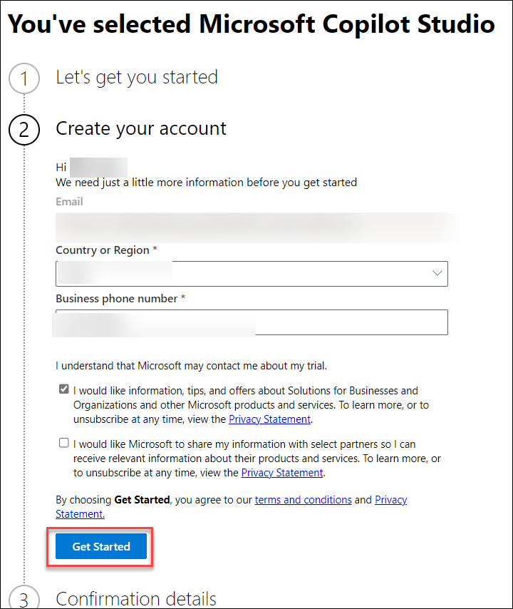

2. Choose the **Copilot** Environment .

   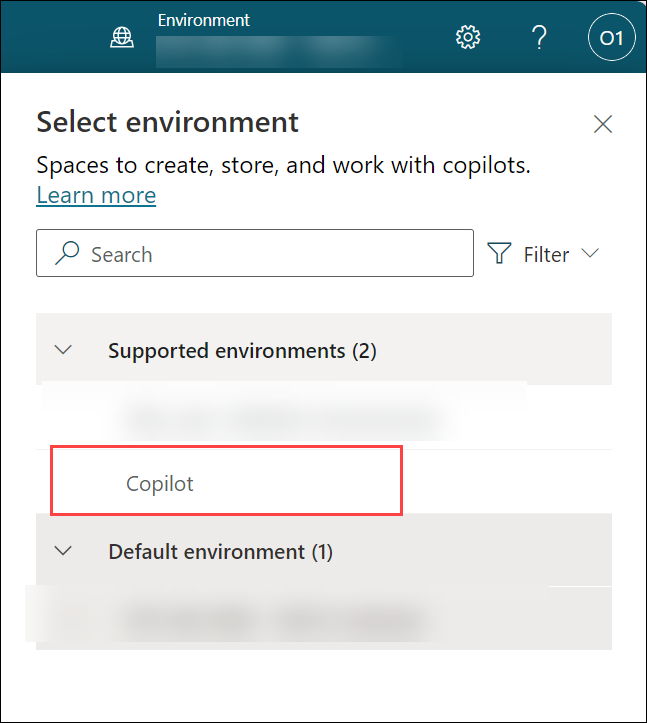

3. To create a new agent click on **New agent** then click on **Skip to Configure**.

   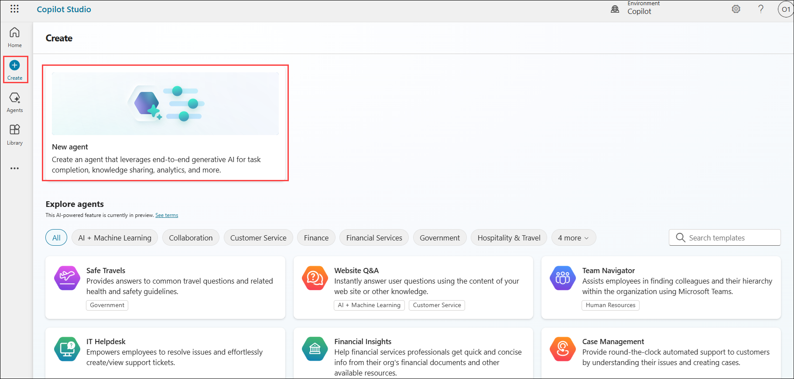
4. Enter the name as **Check Weather (1)** and then select **Create (2)**.
   
   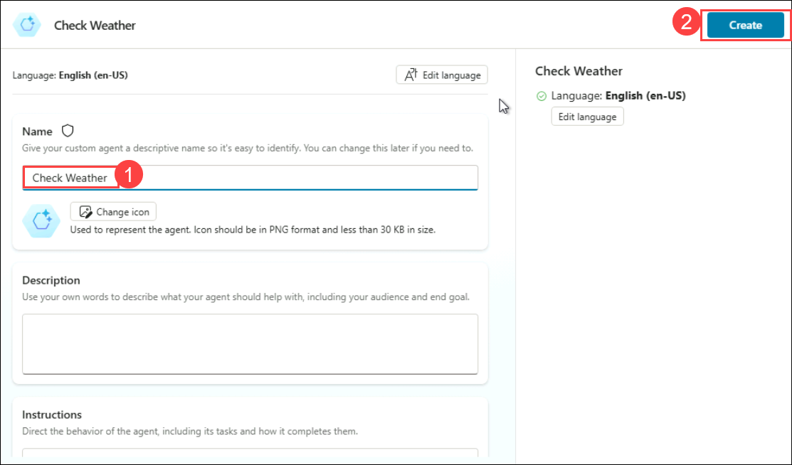
	
5. Select the **Topics (1)**. Click on **+ Add a topic (2)** and then choose an option **From blank (3)**. 

   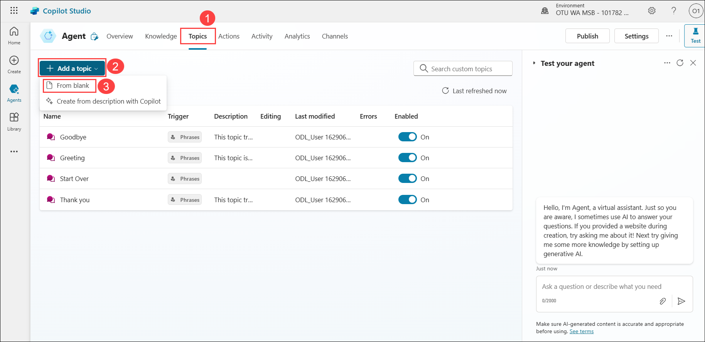

6. Go to **Details (1)** options to Enter **Check Weather (2)** as the name of your topic. Click on **Save (3)**.

   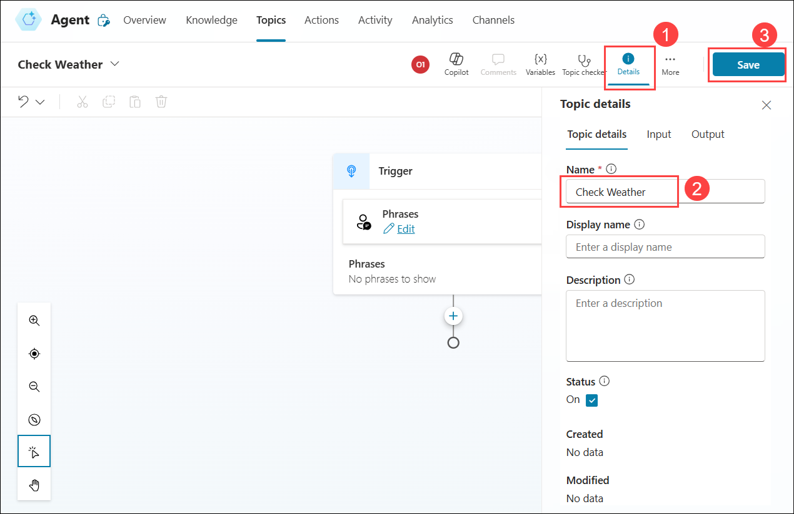

7. Click on **Edit (1)** within Phrases to open a pane to the right of the screen where you can enter simple trigger phrases, such as **What is the weather**, **What is the temperature today**, and **How hot it is (3)** until you have at least five trigger phrases. 

   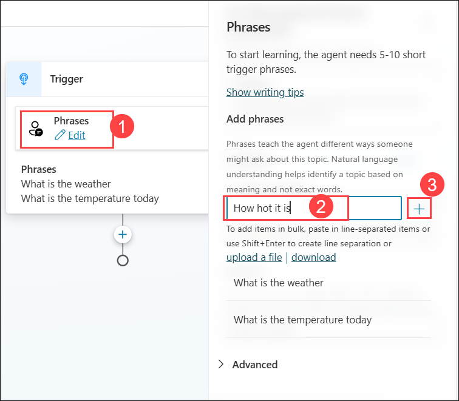

   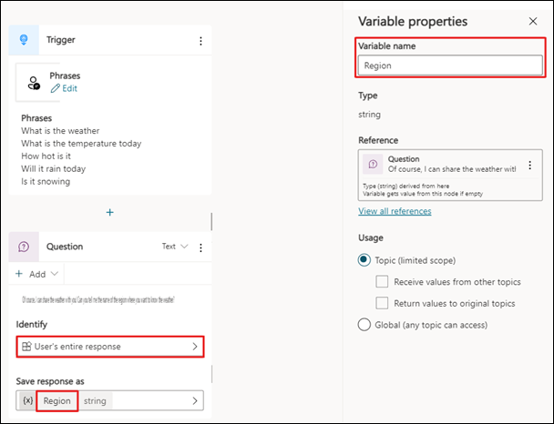

8. Create a **new Question node** below the trigger phrase node and then enter text, such as: `Of course, I can share the weather with you! Can you tell me the name of the region where you want to know the weather?`

   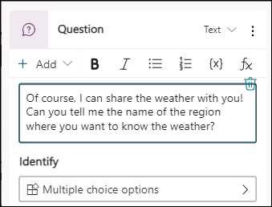

9. Under the Identity select **User's entire response**. Then Rename the variable to **Region**. To do so, select the name of the variable within the node. Within a pane that appears to the right of the screen.

   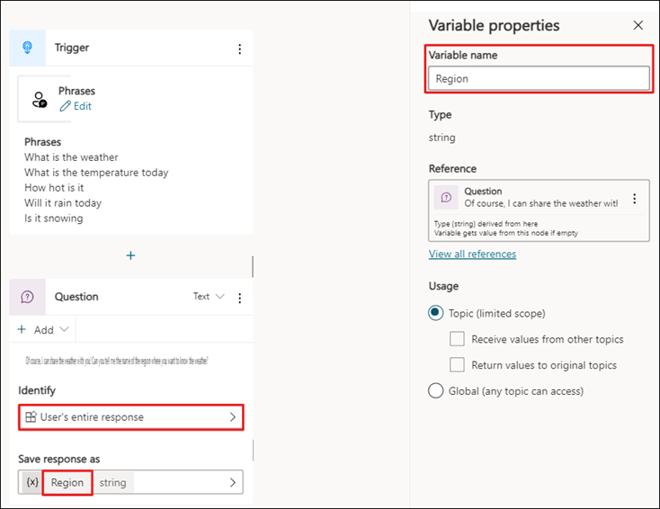

10. Within the top right corner of the screen, select the **Save** button to ensure that your work is saved.

 ## Task 02: Create your Power Automate flow.

 In this task, you'll create a Power Automate flow to automate a specific process. You'll start by defining a trigger to initiate the flow, then set up actions to execute tasks based on the trigger. The goal is to streamline and automate repetitive processes, improving efficiency and productivity. 

1. Select the **Add node** button below the question node to add a new node to the topic. Select **Add an action > New Power Automate flow**. Power Automate opens in a new browser window.

   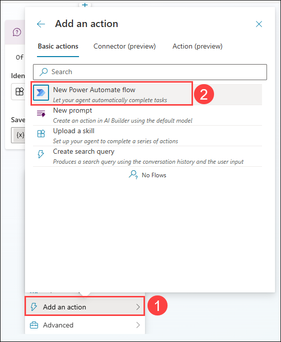

2. Click on the first node **Run a flow from Copilot**, a new flow window will open, select the **Add an input** within the first scaffolded action. Then, select **Text**.

   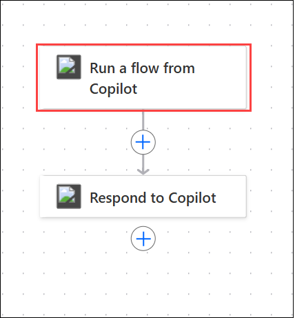
       
   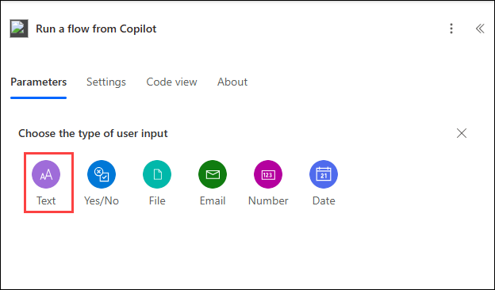

3. Within the first column, enter `Region` (leaving the second column empty).

   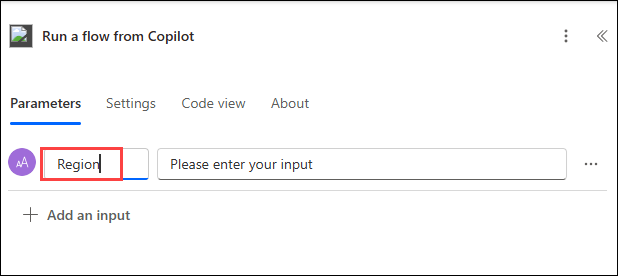

4. Then, right click on the **Insert new step** button to **add a new action**. Select the **Add an action** option from the menu.

   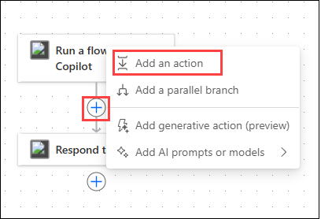

6. Enter `weather` in the search bar and then select **Get current weather by MSN Weather**. Click on **Create new**.
    
   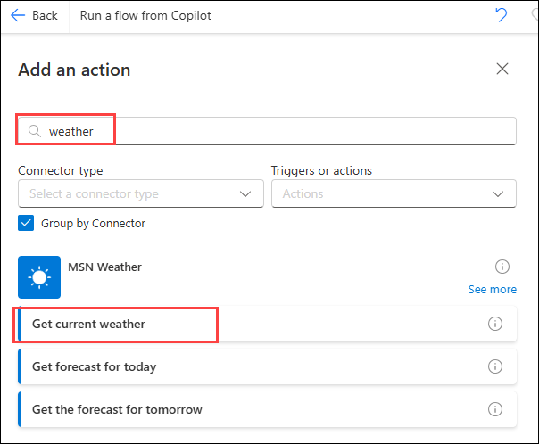

   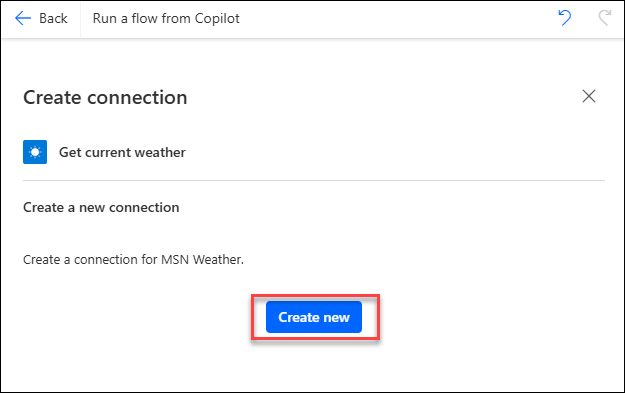

8. A new node appears, where you can enter the location, use **/** to get the Dynamic content drop-down menu, select **Region** and then keep units as **Imperial**.

   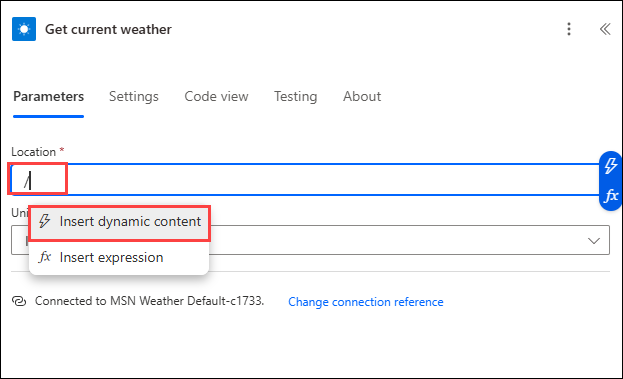

   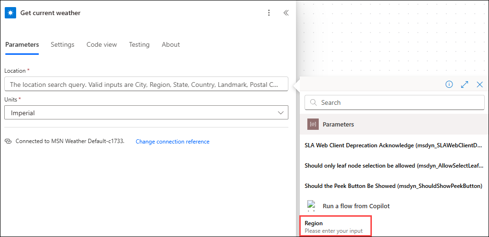

10. Select the **Respond to Copliot** node at the end of the flow, then select **Add an output > Number**. Place your cursor in the **Enter a value to respond** text box. Press **/** to insert dynamic value. Select **Insert dynamic content** and then **Temperature**. Enter **Temperature** in the Title field.

   
   	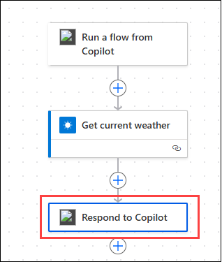

   	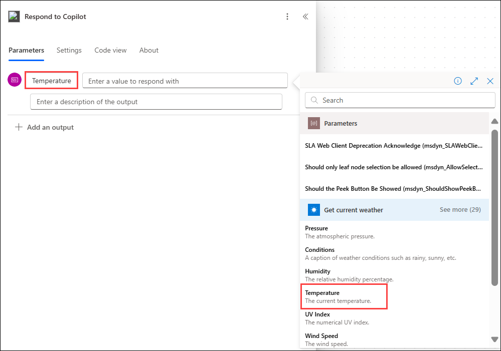

11. The flow is almost complete, select the template title and rename it to `Get Temperature`.

12. Select **Save draft** on the flow in Power Automate to ensure that it saves. Wait a moment until the green banner appears, indicating success then Select **Publish** .

## Task 03 : Connect a Power Automate flow with Microsoft Copilot Studio.

In this task, you'll connect a Power Automate flow with Microsoft Copilot Studio. You'll start by integrating your flow into Copilot Studio, allowing Copilot to assist in configuring and enhancing the flow. This connection enables streamlined automation and leverages Copilot’s capabilities to optimize and refine the flow’s functionality.

1. In this task, you connect a Power Automate flow with Microsoft Copilot Studio `https://web.powerva.microsoft.com`

2. Open your existing topic in Microsoft Copilot Studio, entitled **Weather**, and return to the bottom of your flow, as shown in the following screenshot. Select **Add an action**. Your new Power Automate flow displays in the list. From the list, select **Get Temperature**.

   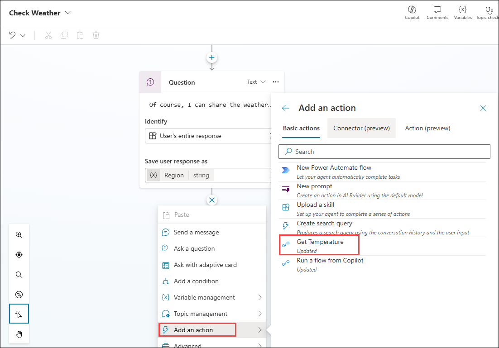

>**Note**: If the flow does not show up, save the Check Weather topic and refresh the page.

3. Select **Enter or select a value** and then select the **Region** variable that you created in previous steps of this lab. 

   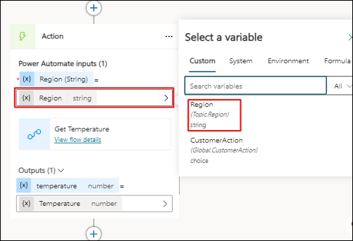

4. Add a Condition node so that you can check if the **Temperature** variable is greater than 75.

5. For the true branch, if the Temperature is greater than 75, add the following text within the 
   Message node:
   `For {Topic.Region} the temperature is {Topic.Temperature} and that is getting warm! Consider cooling off with one of our cold brew coffees.`

>**Note**: The braces { } are variables to display dynamic data. To enter variables into the node, use the {X} button on the Message node and then select a variable from the list.

6. For the All other conditions branch, add the following text within the message node: The temperature for **{Region}** is `{Topic.Temperature}`. Where the braces { } are variables to display dynamic data.
   
   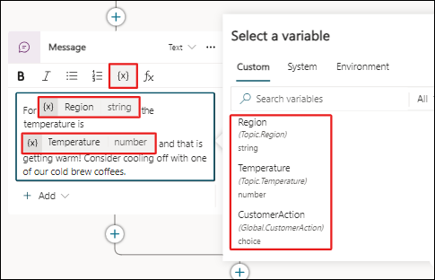

   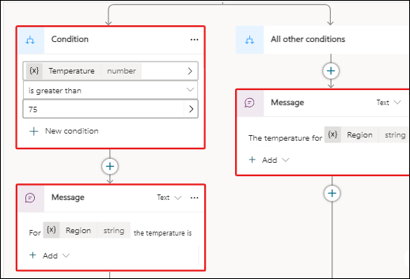

7. To end the conversation, select the **Add node** button below the condition. Select **Topic management** and then choose **End conversation**.

    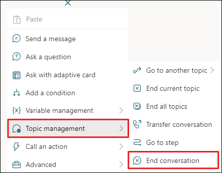

8. **Save** your topic using the button found in the top right corner of the screen and then Click on **Test your agent** and test it out 

   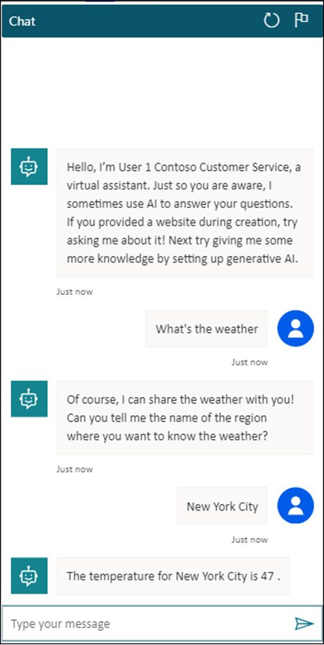
	
9. You successfully created a Power Automate flow and a new topic in Microsoft Copilot Studio that used the flow to provide real-time data from an external service to the user.

## Summary 

In this lab, you have accomplished the following:

- You have created a new topic to organize and categorize your workflows effectively.
- You have built a Power Automate flow to automate a specific process.
- You have connected the flow with Microsoft Copilot Studio to leverage its capabilities for improved configuration and optimization.
  
