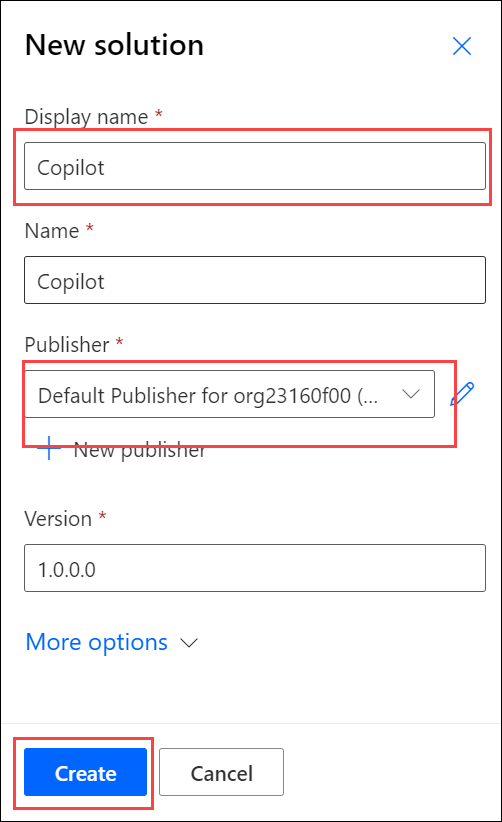
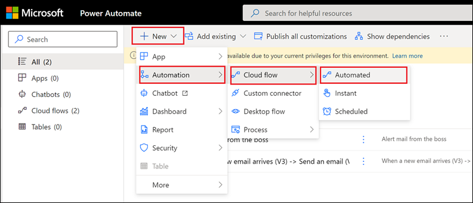
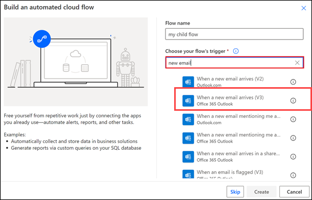
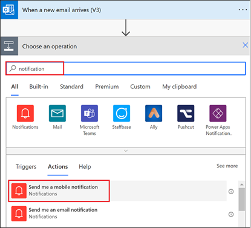
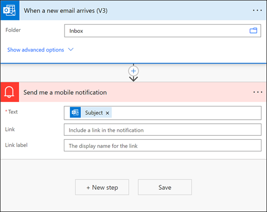
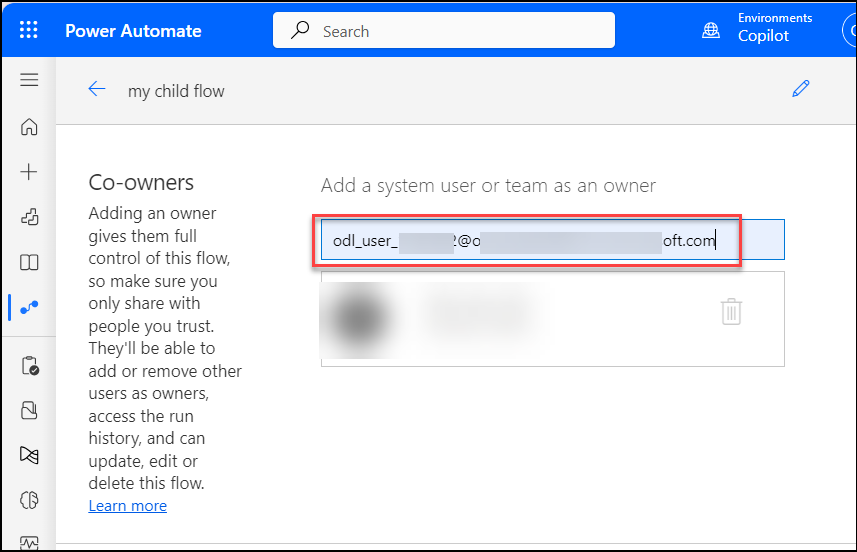
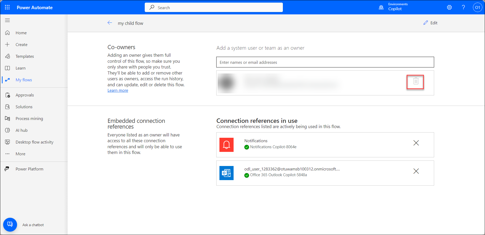
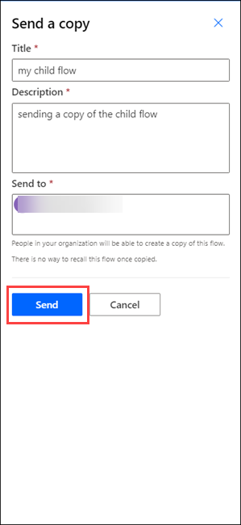

# Lab-05: Share a cloud flow.

## Task-01 : Create A cloud Flow

1.Sign into **https://make.powerautomate.com/**.
   
2.On the menu to the left, select **Solutions**.
   
3.Create a new **solution** named **Copilot**.

    
4.Select **Copilot** under solution and Select **New > Automation > Cloud flow > Automated.**

>**Note**: If an automated cloud flow doesn't meet your requirements, you can create any other type of flow, Power Automate opens.

5.Give your flow a name as **my child flow**.
   
6.Search for, **new email** in the Search all triggers box.
   
7.Select the **When a new email arrives (V3) trigger**.

        
8.Select **Create**.
    
9.Select **New step**.
	
10.Search for **Notification**, and then select the**Send me a mobile notification action**.

11.Add the Subject dynamic token to the Text field of the Send me a mobile notification card.

12.Select **Save** to save your flow.
    
13.Go back and Select **Solutions** to see your flow in the solution.

## Task-02: Add an owner to a cloud flow.

1.Adding an owner to a cloud flow is the most common way to share a cloud flow. Any owner of a cloud flow can perform these actions:
   
2.View the **run history**.
   
3.Manage the properties of the flow (for example, start or stop the flow, add owners, or update credentials for a connection).
   
4.Edit the definition of the flow (for example, add or remove an action or condition).
   
5.Add or remove other owners (but not the flow's creator), including guest users.

> Note: The creator or an owner of a cloud flow, you'll find it listed on the Team flows tab in Power Automate, Shared connections can be used only in the flow in which they were created.Owners can use services in a cloud flow but can't modify the credentials for a connection that another owner created.To add more owners to a cloud flow:

6.Sign in to **https://make.powerautomate.com/**, and then select **My flows**.
   
7.Select the flow that you want to share, select the vertical ellipsis (⋮), and then select Share.
    
8.Enter the name, email address, or group name for the person or group that you want to add as an owner.

   
    
9. The user or group you've selected becomes an owner of the flow.

## Task-03: Add a list as a co-owner

You can add SharePoint lists as co-owners of a cloud flow so that everyone who has edit access to the list automatically gets edit access to the flow. After the flow is shared, you can simply distribute a link to it. 

1. Create and set up a SharePoint list.
   
2. Use a list when the flow is connected to SharePoint, and use a group in all other cases.

3.On the flow details page, in the Owners section, select **Edit**.
   
4.Select **Delete**(the trash can) for the owner you want to remove.
   
5.In the confirmation dialog box, select **Remove**.

 
   

## Task-04: **Send a copy of a cloud flow**

1.On the flow details page command bar, select **Send a copy**.
   
2.On the Send a copy panel, you can edit the name and description of the flow you want to share, and specify the users with whom you want to share it.

 
3.The recipient will receive an email stating that you have shared a cloud flow template with them, and they can then create their own instance of that flow.
